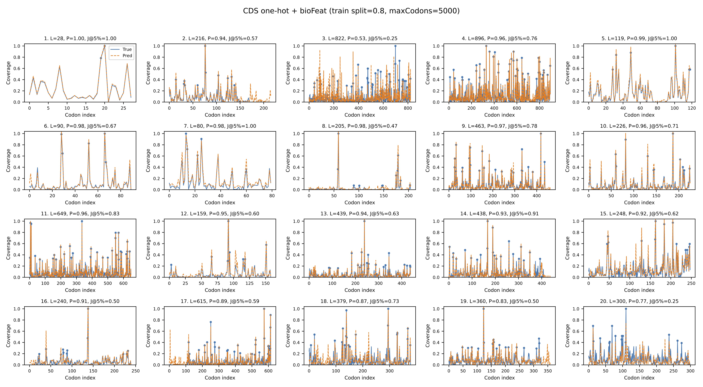

# RiboPipe


**RiboPipe** is lightweight framework for within-sample imputation of codon-resolution ribosome occupancy profiles. 
By learning sequence-dependent translation patterns from high-coverage transcripts, RiboPipe enables accurate and data-efficient reconstruction of codon-level coverage for low-coverage transcripts within the same condition.

The pipeline supports:

-   Transcript-level preprocessing from raw P-site count matrices
-   Codon-resolution coverage extraction
-   Biological feature integration (e.g., tRNA copy number)
-   Length-aware training for codon-level prediction
-   Export of coverage matrices for downstream analysis

 

------------------------------------------------------------------------

## Installation

``` bash
wget ribopipe_mvp.zip
unzip ribopipe_mvp.zip

cd ribopipe_mvp
pip install -e .
```

------------------------------------------------------------------------

## Workflow Overview

    Raw P-site CSV (generated using ribowaltz)
          │
          ▼
    ribopipe preprocess
          │
          ▼
    Per-sample transcript NPZ files
          │
          ├── ribopipe matrix  → coverage matrix (transcript × sample)
          │
          ├── ribopipe biofeat → biological feature file (.npz)
          │
          ▼
    ribopipe train_pipeline → codon-level prediction model

------------------------------------------------------------------------

## Usage

### Step 1: Preprocess Ribo-seq CSV

Prepare:

-   A P-site count CSV file
-   A transcript reference FASTA file

Raw ribo-seq data is processed using [riboWaltz](https://github.com/LabTranslationalArchitectomics/riboWaltz).
The processed file is saved in CSV format.

```
"","transcript","start","end","from_cds_start","from_cds_stop","region","HEK293F_WT_DMSO_rep1","HEK293F_WT_DMSO_rep2"
...
"25","ENST00000000233.10",73,76,-5,-185,"5utr",0,0
"26","ENST00000000233.10",76,79,-4,-184,"5utr",1,0
"27","ENST00000000233.10",79,82,-3,-183,"5utr",0,0
"28","ENST00000000233.10",82,85,-2,-182,"5utr",0,0
"29","ENST00000000233.10",85,88,-1,-181,"5utr",3,1
"30","ENST00000000233.10",88,91,0,-180,"cds",1,1
"31","ENST00000000233.10",91,94,1,-179,"cds",0,0
"32","ENST00000000233.10",94,97,2,-178,"cds",1,0
"33","ENST00000000233.10",97,100,3,-177,"cds",1,5
"34","ENST00000000233.10",100,103,4,-176,"cds",5,2
"35","ENST00000000233.10",103,106,5,-175,"cds",1,0
"36","ENST00000000233.10",106,109,6,-174,"cds",0,0
"37","ENST00000000233.10",109,112,7,-173,"cds",0,2
"38","ENST00000000233.10",112,115,8,-172,"cds",3,3
"39","ENST00000000233.10",115,118,9,-171,"cds",0,2
"40","ENST00000000233.10",118,121,10,-170,"cds",1,1
"41","ENST00000000233.10",121,124,11,-169,"cds",0,1
"42","ENST00000000233.10",124,127,12,-168,"cds",2,3
"43","ENST00000000233.10",127,130,13,-167,"cds",4,1
"44","ENST00000000233.10",130,133,14,-166,"cds",1,0
"45","ENST00000000233.10",133,136,15,-165,"cds",0,0
...
```


Example:

``` bash
ribopipe preprocess   --csv data/psite_counts.csv   --fasta data/transcripts.fa   --out-dir output_dir   --fasta-cache output_dir/fasta_cache.pkl
```

------------------------------------------------------------------------

### Step 2: Generate Coverage Matrix

``` bash
ribopipe matrix   --npz-dir output_dir   --out-csv output_dir/coverage_matrix_transcript_x_sample.csv
```

------------------------------------------------------------------------

### Step 3: Generate Biological Features

``` bash
ribopipe biofeat   --cds-npz output_dir/sample_name.npz   --trna-json trna_copy_numbers.json   --out-npz output_dir/bio_features.npz
```

trna_copy_numbers.json are generated based on GtRNAdb for Homo sapiens (https://gtrnadb.ucsc.edu/genomes/eukaryota/Hsapi38/Hsapi38-summary-all.html). For preparing bioFeat for other spieces, please based on the GtRNAdb information for generating the JSON file of trna_copy_numbers.json.  

------------------------------------------------------------------------

### Step 4: Train Codon-Level Prediction Model

``` bash
ribopipe train_pipeline   --coverage-csv output_dir/coverage_matrix_transcript_x_sample.csv   --npz-dir output_dir   --bio-feat output_dir/bio_features.npz   --threshold P75   --epochs 200   --train-split 0.8   --max-codons 5000 --output-dir ./predictions
```

------------------------------------------------------------------------

## Key Parameters

  |Parameter      | Description |
  |--------------- |-------------------------------------------------------|
  |--threshold     |Select high-expression transcripts (e.g., P75 or P95)|
  |--train-split   |Fraction of transcripts used for training|
  |--epochs        |Number of training epochs|
  |--max-codons    |Maximum CDS length (truncated/padded)|
  |--output-dir    |File Fold for saving prediction results| 

------------------------------------------------------------------------

## Output Structure

    output_dir/
    ├── *.npz
    ├── coverage_matrix_transcript_x_sample.csv
    ├── bio_features.npz
    └── model_checkpoint.pt
    
    predictions/ (determined by --output-dir)

------------------------------------------------------------------------

## Reference
Tetailed information is shown in:

> Zhang Y. et al. RiboPipe: efficient per-transcript codon-resolution ribo-seq imputation. bioRxiv (2026). [https://doi.org/10.64898/2026.03.20.711481v1](https://www.biorxiv.org/content/10.64898/2026.03.20.711481v1) 


```bibtex
@article{zhang2026ribopipe,
  title   = {RiboPipe: efficient per-transcript codon-resolution ribo-seq imputation},
  author  = {Zhang, Yaozhong and Hashimoto, Satoshi and others},
  journal = {bioRxiv},
  year    = {2026},
  doi     = {10.64898/2026.03.20.711481v1},
  url     = {https://www.biorxiv.org/content/10.64898/2026.03.20.711481v1}
}
```

## License

MIT License
