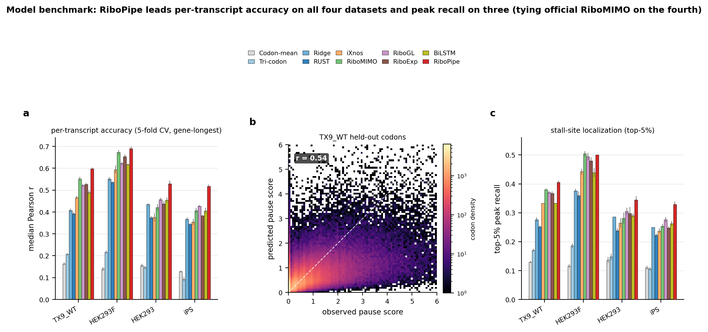

# RiboPipe

*An interpretable sequence-to-occupancy model for reliability-aware imputation of
low-depth ribosome profiling.*

**Within-sample Ribo-seq imputation**: learn a sequence-to-occupancy mapping from a
sample's own high-coverage transcripts and use it to recover codon-resolution ribosome
pause profiles for the same sample's sparse transcripts.

## Headline results — gene-level 5-fold cross-validation

The honest benchmark holds out **whole genes** (every isoform of a gene stays in one
fold), so the numbers reflect generalisation to sequences the model has never seen.

| Dataset | per-transcript Pearson *r* | Top-5 % peak recall |
|---|---:|---:|
| TX9_WT (HEK293)          | **0.598** | 0.405 |
| GSE233886_WT (HEK293F)   | **0.690** | 0.500 |
| GSE133393_WT (HEK293)    | **0.529** | 0.345 |
| PRJNA_iPS (iPSC)         | **0.518** | 0.329 |

RiboPipe leads per-transcript Pearson on all four datasets and top-5 % peak recall on
three of four (tying official RiboMIMO on GSE233886_WT), at **~0.35 M parameters** — a
fifth of RiboMIMO and an eighth of RiboGL. Reproduce with
[`reproduce/run_cv5.sh`](reproduce/README.md).

> **On the ~0.98 transcript-level number.** A plain *transcript*-level split leaks:
> isoforms of the same gene share near-identical sequence, so a held-out isoform's twin
> sits in the training set. That regime (≈0.98 Pearson) measures **deployment recall** —
> filling in a sparse isoform when a dense sibling of the *same gene* was observed. It is
> a real and useful quantity, but it is **not** comparable to the gene-level headline
> above and the paper never leads with it. See `reproduce/README.md`.



*Gene-level 5-fold cross-validation (scored on the gene-longest transcript per gene;
mean ± SD across folds). RiboPipe (~0.35 M parameters) leads per-transcript accuracy across
the human datasets while staying far smaller than the deep-learning baselines — Figure 1 of
the paper.*

## The headline model: motif-CNN (k=7) + BiGRU-128

A k=7 **exp-motif CNN** (readable first-layer filters) → k=3 taper conv → a single
**bidirectional GRU (h=128)** over a 187-channel per-codon input:

| Feature group | Dims | Description |
|---------------|-----:|-------------|
| Codon identity | 64 | one-hot (built inside the model) |
| Nucleotide context | 120 | one-hot of the ±15 nt window (30 nt) around the A-site |
| Local mRNA structure | 3 | ViennaRNA MFE of 30-nt folds at offsets −17/−16/−15 |
| **Total (first-conv channels)** | **187** | hand-crafted biological features are **off by default** |

- **Backbone:** `Conv1d(187→128, k=7, exp)` → `Conv1d(128→64, k=3)` →
  `BiGRU(64→128, bidirectional)` → `Linear(256→32) → ReLU → Linear(32→1)`.
  **≈0.35 M parameters** (`ribopipe.model.RiboPipeCNN`).
- **Target:** covered-mean-normalised `log(1+µ)` pause score.
- **Loss:** unweighted **Huber** (δ = 1) — the paper's training default.
- **Early stopping** on the median per-transcript Pearson of a gene-level validation
  hold-out (patience 20, up to 200 epochs).

The interpretable first-layer filters read out directly as the E/P/A elongation motifs.
The legacy two-layer BiLSTM headline remains available via `--backbone bilstm`; every
feature group is a toggle (`--no-nt`, `--no-struct`, `--with-bio`) reproducing the paper's
feature-ablation rows. The paper's released checkpoints load with
`ribopipe.model.load_cnn_from_paper_checkpoint`.

## Installation

```bash
# from GitHub (recommended)
pip install "git+https://github.com/yaozhong/riboPipe.git"

# or from a clone (editable; the [struct] extra pulls in ViennaRNA for the MFE cache)
git clone https://github.com/yaozhong/riboPipe
cd riboPipe
pip install -e ".[struct]"
```

This installs the **`ribopipe`** command-line tool and the `ribopipe` Python package
(headline `RiboPipeCNN`, training / 5-fold CV / prediction, and the baselines).
Requirements: Python ≥ 3.8, PyTorch ≥ 1.12, NumPy, Pandas, SciPy, scikit-learn,
Biopython. ViennaRNA (`ViennaRNA>=2.5`, the `[struct]` extra) is needed **only** to
(re)generate the structure cache; training and prediction on an existing cache do not
import it.

The four pre-trained headline checkpoints are in `checkpoints/` in the repository (not
shipped in the pip wheel); load one with
`ribopipe.model.load_cnn_from_paper_checkpoint(path)`.

## Data processing

RiboPipe consumes **per-codon Ribo-seq counts**, not raw reads: the entry point is a
codon-level counts CSV plus a CDS FASTA. The preprocessing that turns these into
model-ready tensors is shared across all datasets in the paper and ships with the package
under `ribopipe/preprocess/`.

**Input CSV schema** — one row per codon, validated by `ribopipe.preprocess.schema`:

| Column | Meaning |
|---|---|
| `transcript` | transcript ID (matches the FASTA header) |
| `start`, `end` | codon coordinates |
| `from_cds_start`, `from_cds_stop` | codon offset from the CDS start / stop |
| `region` | `5UTR` / `CDS` / `3UTR` |
| one column **per sample** | per-codon read count for that sample |

Sample columns follow `Celltype|genotype|treatment|replicate|type|remarks`
(e.g. `HEK293T|WT|DMSO|rep1|mono|x`); the legacy `<condition>_repN` form is also accepted.

**Preprocessing chain** (the four steps of the Quick start below):

1. `ribopipe preprocess` — CSV (+ CDS FASTA) → per-transcript NPZ (`cds.sequence`, `cds.avg_count`).
2. `ribopipe matrix` — the NPZ directory → a transcript × sample coverage matrix, used for the high-/low-coverage split.
3. `ribopipe biofeat` — per-codon biological features (ported unchanged from the original `bioFeat_gen.py`); optional — the headline model runs without them.
4. `ribopipe struct` — the ViennaRNA local-structure (MFE) feature cache.

Producing the codon-count CSV from raw reads (alignment, P-site offset assignment, codon
summarisation) is done upstream with standard Ribo-seq tooling and is not part of this
package.

## Quick start (one sample, end to end)

```bash
# 1. Preprocess raw CSV to per-transcript NPZ
ribopipe preprocess --csv codon_counts.csv --fasta transcripts_cds.fa --out-dir ./npz

# 2. Build transcript × sample coverage matrix
ribopipe matrix --npz-dir ./npz --out-csv coverage_matrix.csv

# 3. Generate per-codon biological features
ribopipe biofeat --cds-npz ./npz/my_sample.npz --trna-json trna_abundances.json \
  --out-npz bio_features.npz

# 4. Precompute the ViennaRNA local-structure (MFE) cache  (one-time per dataset)
ribopipe struct --npz ./npz/my_sample.npz
#   -> ./npz/struct_cache/my_sample_struct.npz

# 5. Train the headline model
ribopipe train \
  --npz ./npz/my_sample.npz \
  --bio-npz bio_features.npz \
  --struct-npz ./npz/struct_cache/my_sample_struct.npz \
  --coverage-csv coverage_matrix.csv \
  --sample my_sample \
  --enst2ensg reproduce/enst2ensg_grch38.json.gz \
  --out-dir ./model

# 6. Predict pause profiles for all transcripts
ribopipe predict \
  --checkpoint ./model/ribopipe_model.pt \
  --npz ./npz/my_sample.npz \
  --bio-npz bio_features.npz \
  --struct-npz ./npz/struct_cache/my_sample_struct.npz \
  --out-csv predictions.csv
```

The checkpoint stores its own feature configuration, so `predict` restores the exact
training setup automatically. Pass `--no-struct` at step 5 (and drop `--struct-npz`) for
the codon+bio+NT ablation that needs no ViennaRNA.

See [`examples/run_ribopipe.sh`](examples/run_ribopipe.sh) for a complete annotated script.

## Reproduce the headline benchmark

```bash
NPZ=./npz/my_sample.npz \
BIO=bio_features.npz \
STRUCT=./npz/struct_cache/my_sample_struct.npz \
bash reproduce/run_cv5.sh
```

Gene-level 5-fold CV of the headline model against the baselines (codon-mean, tri-codon,
ridge, BiLSTM-base). See [`reproduce/README.md`](reproduce/README.md).

## Python API

```python
import ribopipe

# Train the headline model on a set of high-coverage transcript IDs
model = ribopipe.train_on_ids(
    "sample.npz", "bio_features.npz", train_ids, val_ids=val_ids,
    struct_npz_path="struct_cache/sample_struct.npz",
    use_nt=True, use_struct=True, use_bio=False,   # headline: codon + NT(+/-15) + struct MFE (no bio features)
    loss_name="huber",                              # unweighted Huber (delta=1)
)   # backbone="cnn" (default) = motif-CNN k=7 + BiGRU-128 (h=128), ~0.35M params

# Predict
preds = ribopipe.predict(
    model, "sample.npz", "bio_features.npz", test_ids,
    struct_npz_path="struct_cache/sample_struct.npz",
    use_nt=True, use_struct=True, use_bio=False,
)  # dict: transcript_id -> np.ndarray (pause scores, len = CDS codons)

# Gene-level 5-fold CV
summary = ribopipe.run_cv5(
    "sample.npz", "bio_features.npz", all_ids,
    enst2ensg_path="reproduce/enst2ensg_grch38.json.gz",
    struct_npz_path="struct_cache/sample_struct.npz",
    methods=["ribopipe", "bilstm_base", "tricodon"],
)
```

## Design

RiboPipe frames Ribo-seq imputation as **within-sample learning**:

1. **T_high** (top-coverage transcripts) — used for training and evaluation.
2. **T_low** (the sparse remainder of the transcriptome) — prediction targets.

All model-selection and benchmarking splits are **gene-level** to avoid isoform leakage.

An **independent-read-split** analysis identifies a crossover depth
**D\* ≈ 0.22–0.57 reads/codon**, below which the model's prediction is more reliable than
a transcript's own sparse reads — a regime that covers **52–82 % of expressed genes**. This
is the *reliability-aware* part of the title: RiboPipe reports not only what the pause
profile is, but when to trust it over the raw reads. A depth-weighted hybrid of prediction
and reads then matches or exceeds either source alone at every depth tested.

## Data availability

Public datasets used in the paper: GEO **GSE133393** and **GSE233886**, and BioProject
**PRJNA976655**. The in-house HEK293 dataset (TX9_WT) will be deposited in GEO upon
publication, with reviewer access available on request.

## Citation

If you use RiboPipe, please cite:

> Zhang Y-z., Hashimoto S., Li S., Inada T., Imoto S.
> *RiboPipe: an interpretable sequence-to-occupancy model for reliability-aware imputation
> of low-depth ribosome profiling.* Submitted to *Briefings in Bioinformatics* (2026).

## License

MIT — see [LICENSE](LICENSE).
